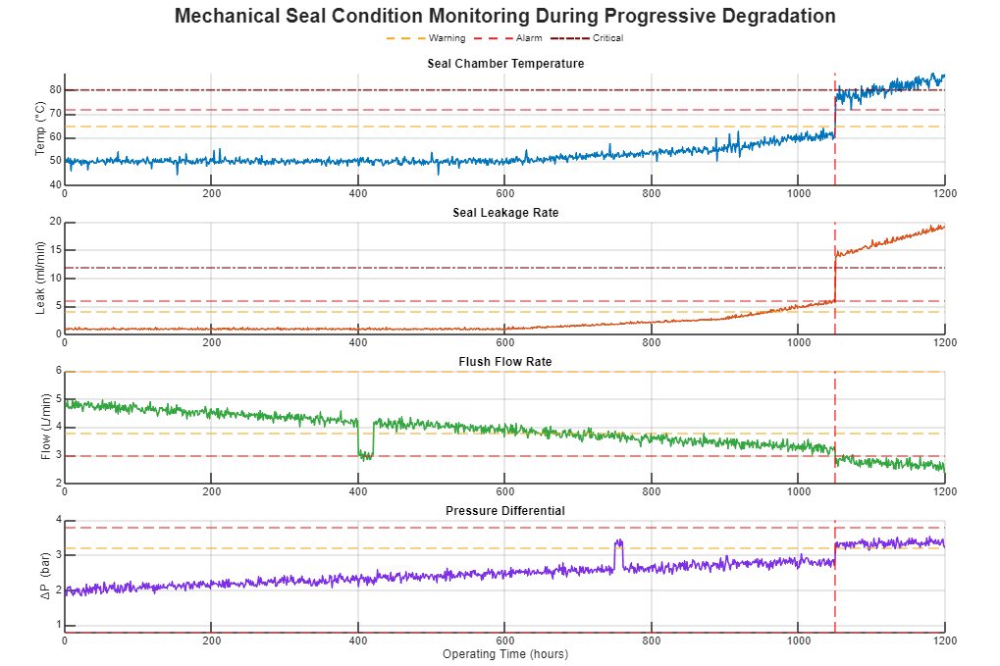
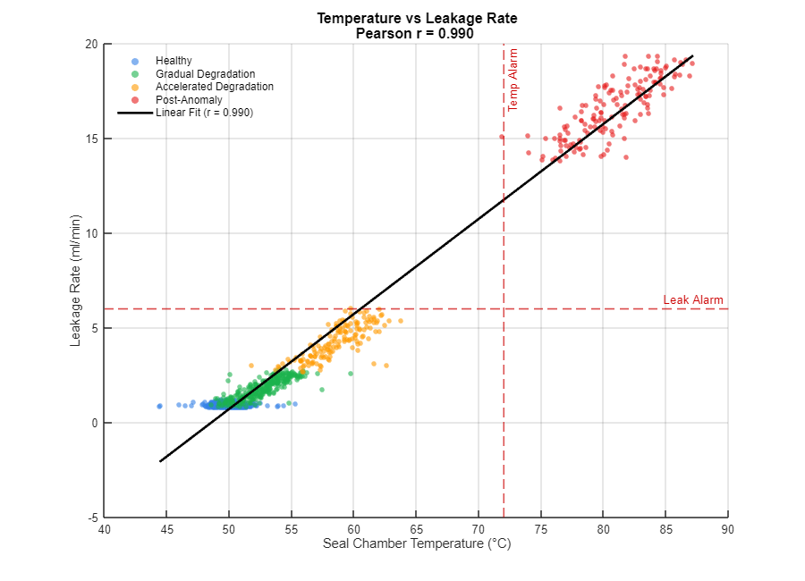
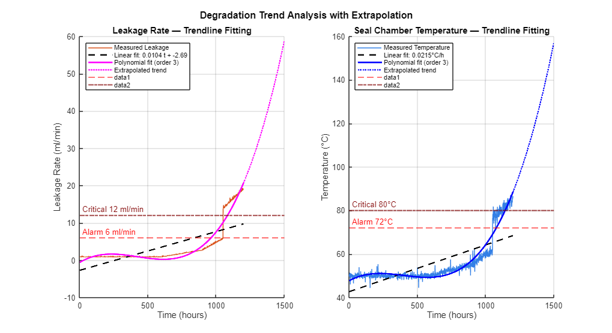
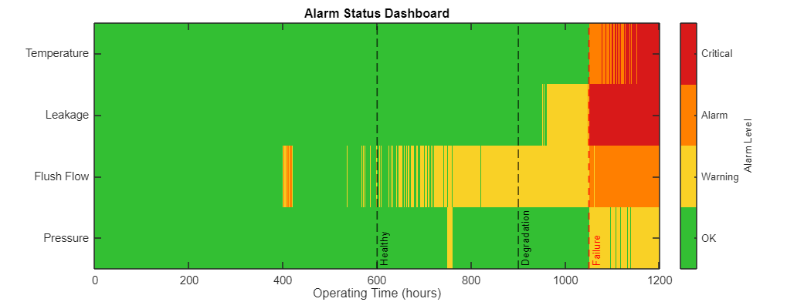

# Mechanical Seal Condition Monitoring & Trend Analysis

A MATLAB simulation of a mechanical seal on a centrifugal pump, from healthy operation to failure. It generates realistic sensor data, then applies the same analysis techniques used in real predictive maintenance programs: trend monitoring, correlation analysis, degradation curve fitting, alarm detection, and Remaining Useful Life (RUL) estimation.

---

## 1. Goal

**Problem:** Mechanical seals are a leading failure point on centrifugal pumps. A failed seal can mean unplanned downtime, fluid loss, and safety risk. The good news is that failures are usually preceded by slow, measurable degradation — the challenge is catching it early and knowing how much time is left.

**Why it matters:** Industries are shifting from calendar-based maintenance to condition-based/predictive maintenance (CBM/PdM), because it avoids unnecessary servicing of healthy equipment while still catching failing equipment before it breaks down.

**Outcomes:** Time-series plots with alarm thresholds, a correlation study linking temperature and leakage, degradation trendlines with extrapolation, an automated alarm log, and a RUL estimate with a maintenance recommendation.

**Applications:** Pump/compressor reliability programs, refinery and chemical plant maintenance, PdM system design, and SCADA/historian alarm design.

---

## 2. Project Description

### Overview

The script runs in nine steps:

1. Build a 1200-hour timeline split into four phases: healthy → gradual degradation → accelerated degradation → post-anomaly.
2. Generate four synthetic signals (temperature, leakage, flush flow, pressure) with realistic drift and noise.
3. Define Warning / Alarm / Critical thresholds for each signal.
4. Plot all four signals over time with thresholds overlaid.
5. Correlate temperature against leakage rate.
6. Fit linear and polynomial trendlines and extrapolate them forward.
7. Scan the data and report every threshold violation.
8. Build a combined color-coded alarm dashboard.
9. Estimate Remaining Useful Life and validate it against the actual failure time.

### Engineering Background

A mechanical seal keeps process fluid from leaking along a pump shaft using two flat faces pressed together with a thin fluid film between them. As the faces wear: leakage increases, friction raises the seal chamber temperature, and if flush flow (which cools and lubricates the faces) drops, wear accelerates further. Because these effects feed into each other, the four parameters tend to degrade together — which is why watching them in combination is more reliable than watching just one.

**RUL (Remaining Useful Life)** is estimated by fitting a curve to the degradation trend, extrapolating it forward, and finding when it crosses the critical threshold. The result depends heavily on how much of the accelerating trend is already visible in the data — this project actually demonstrates that by predicting RUL at two different times and comparing accuracy.

### Operating Assumptions

- This is **synthetic data**, built to illustrate the method — not real plant readings.
- Degradation is split into four distinct phases for clarity; real-world wear is more continuous.
- Sensor noise is modeled as random (Gaussian/half-normal); real sensors may drift or have other noise types.
- Threshold values are realistic and representative, not pulled from one specific OEM datasheet.
- Data is sampled once per hour; real systems often sample much faster.
- Sensors are assumed to always work correctly — no simulated sensor faults or dropouts.
- RUL is estimated with a simple polynomial curve fit, not a physics-based wear model.

### Operating Conditions

```
Pump Type              : Centrifugal process pump (single-stage, end-suction)
Seal Type              : Single mechanical seal, API 682 style
Seal Flush Plan        : API Plan 11 (orifice-controlled flush)
Working Fluid          : Process liquid (e.g., light hydrocarbon / water-based stream)
Seal Chamber Temp      : ~50°C baseline | Alarm 72°C | Critical 80°C
Seal Leakage Rate      : ~0.8 ml/min baseline | Alarm 6 ml/min | Critical 12 ml/min
Flush Flow Rate        : ~4.8 L/min nominal | Low Alarm 3.0 L/min | High Warning 6.0 L/min
Pressure Differential  : ~2.0 bar nominal | High Alarm 3.8 bar | Low Alarm 0.8 bar
Sampling Interval      : 1 hour
Monitoring Duration    : 1200 hours (~50 days)
Failure Mode           : Progressive wear + sudden anomaly event at 1050 h
```

---

## 3. Results

**Time-series monitoring** — all four parameters plotted together, with a clear step-change at the 1050-hour anomaly:



**Correlation** — temperature and leakage are strongly linked (Pearson r = 0.990), confirming they degrade together:



**Trend fitting** — a polynomial fit captures the accelerating wear far better than a straight line:



**Alarm dashboard** — a single view showing when each parameter moves from OK → Warning → Alarm → Critical:



**RUL validation:**

| Prediction Point | Estimated RUL | Recommendation |
|---|---|---|
| 900 h | Could not be estimated | Not enough trend data yet |
| 1050 h | 140 h (5.8 days) | Schedule maintenance immediately |

Actual failure occurred at 1051–1056 h — meaning the 1050 h prediction was accurate, while the 900 h prediction was too early to work. This shows why RUL accuracy depends on having enough of the accelerating trend already in the data.

---

## 4. Repository Structure

```
├── untitled3_media/
│   ├── figure_0.png
│   ├── figure_1.png
│   ├── figure_2.png
│   └── figure_3.png
├── Condition_monitoring.mlx
├── SUMMARY.md
├── README.md
└── TECHNICAL_DOCUMENTATION.md
```

## 5. Requirements & How to Run

- MATLAB R2024b , Statistics and Machine Learning Toolbox
- Open `Condition_Monitoring.mlx` and run it. Four figures will appear, and alarm/RUL reports print to the Command Window.

## 6. Disclaimer

This uses **synthetic data** for educational purposes — it is not from a real pump or manufacturer and should not be used directly for real maintenance decisions.
